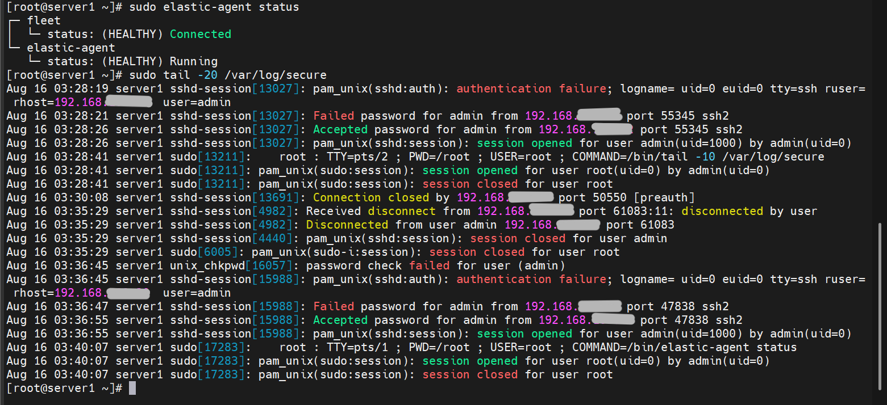
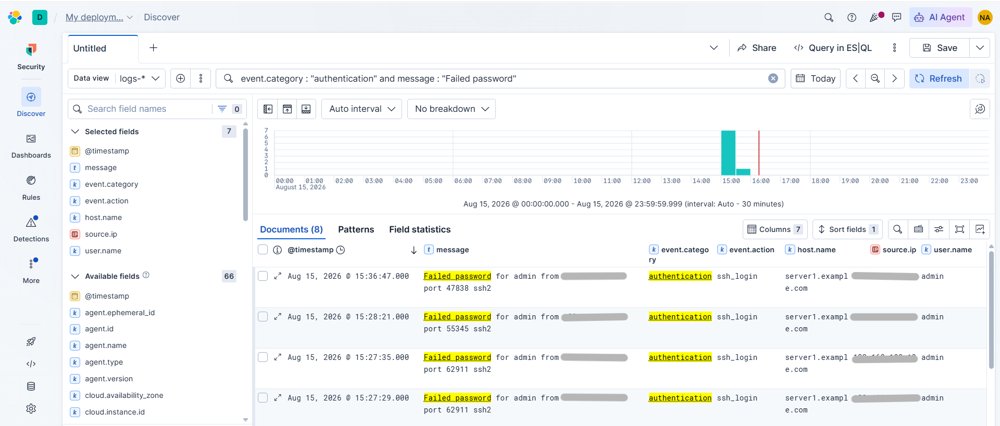
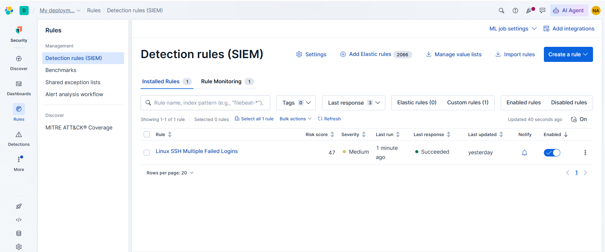
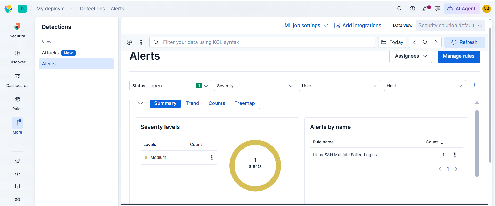
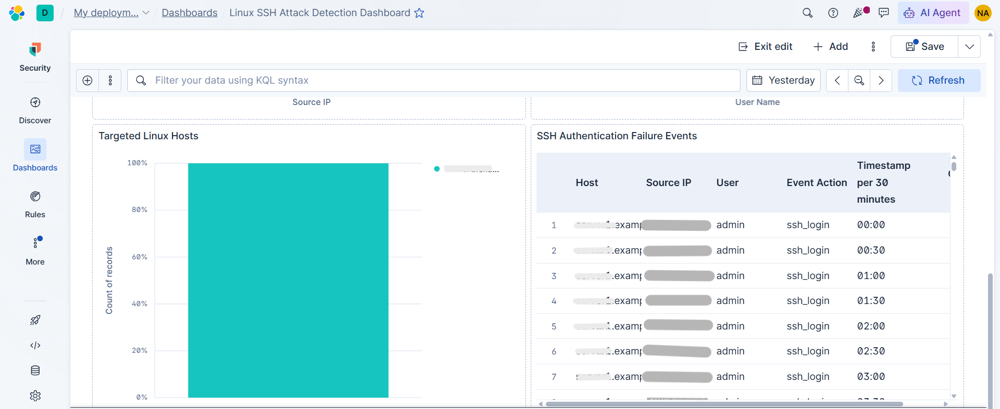

# Linux SSH Attack Detection with Elastic Security

## Overview

This project demonstrates an end-to-end Linux SSH authentication monitoring and detection workflow using Elastic Security.

The lab collects Linux SSH authentication logs from a CentOS server using Elastic Agent, sends the logs to Elastic Cloud, investigates failed authentication events in Kibana Discover, creates a threshold-based detection rule, generates security alerts, and visualizes the activity through a custom dashboard.

---

## Objectives

- Collect Linux SSH authentication logs
- Monitor failed SSH login attempts
- Ingest Linux authentication logs into Elastic Cloud
- Investigate authentication events using Kibana Discover
- Create a threshold-based detection rule
- Generate and investigate security alerts
- Build a dashboard for SSH attack visibility

---

## Technologies Used

* CentOS Linux
* OpenSSH
* Elastic Agent
* Elastic Cloud
* Elastic Security
* Kibana Discover
* Kibana Dashboards
*  Kibana Query Language (KQL)
* Linux authentication logs
  
## Investigation Query

```kql
event.category: "authentication" and message: "Failed password"

```

## Detection Rule

### Rule Name

  Linux SSH Multiple Failed Logins

### Rule Type

  Threshold rule

### Severity

  Medium

The rule detects multiple failed SSH authentication events and generates an alert when the configured threshold is reached.


## Project Screenshots

### CentOS SSH Authentication Logs



### Failed SSH Events in Elastic Discover



### Detection Rule



### Detection Alert



### Linux SSH Attack Detection Dashboard



---

## Skills Demonstrated

* SSH authentication monitoring
* Linux log analysis
* Elastic Agent configuration
* Elastic Cloud data ingestion
* Kibana Discover
* KQL-based event filtering
* Detection rule creation
* Threshold-based detection
* Security alert investigation
* Security dashboard creation

---

## Author

**Noor-ul-Huda (hudanoor-01)**


